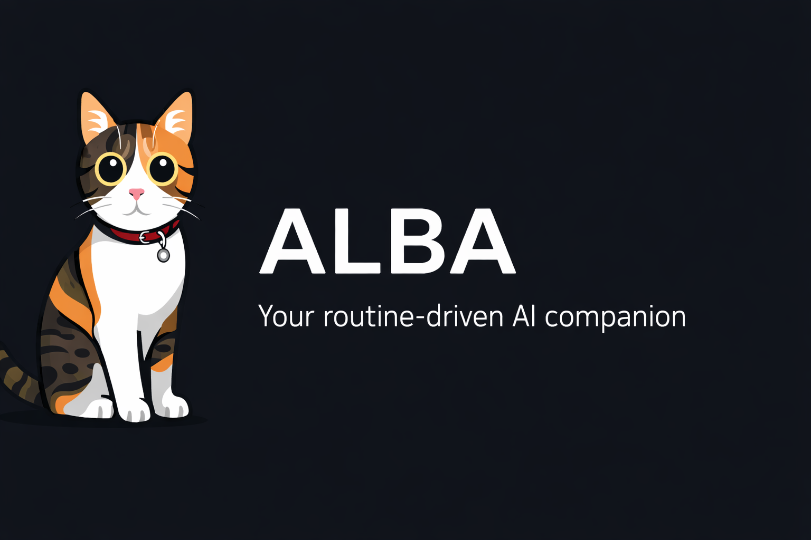
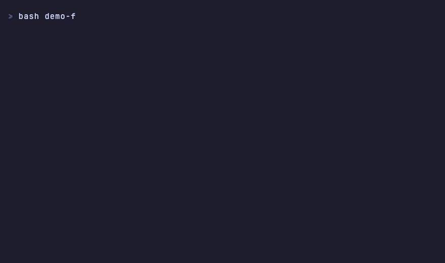

<p align="center">
  
</p>

<p align="center">
  <a href="README.md">English</a> | <a href="README.tr.md">Türkçe</a> | <a href="README.de.md">Deutsch</a>
</p>

<p align="center">
  <a href="LICENSE"></a>
  <a href="https://docs.anthropic.com/en/docs/claude-code"></a>
  <a href="https://github.com/onurpolat05/ALBA/stargazers"></a>
</p>

---

ALBA transforms Claude Code into a **personal AI agent** that remembers your priorities, learns from your mistakes, and adapts to your workflow — whether you're a developer, PM, researcher, founder, or content creator.

**10-minute interactive setup. Zero dependencies. Pure markdown.**

<p align="center">
  
</p>

## The Problem

Every new Claude Code session starts from zero. No memory of yesterday's priorities. No context about your projects. Same mistakes repeated. You re-explain your workflow every time.

## The Solution

```
you@machine:~/alba$ claude
> /setup
```

Answer 7 questions. ALBA builds a personalized agent system with persistent memory, automated workflows, and self-improving behavior — tailored to your role.

## What You Get

```
your-agent/
├── CLAUDE.md                     # Agent brain (< 200 lines)
├── memory/
│   ├── state/                    # Priorities, tasks (updated every session)
│   ├── knowledge/                # Learnings, errors, preferences (auto-updated)
│   ├── projects/                 # Per-project context
│   └── daily/                    # Session logs (auto-created)
├── .claude/
│   ├── skills/                   # 9 built-in skills
│   ├── hooks/                    # 6 automated event handlers
│   ├── rules/                    # Behavioral guidelines (auto-loaded)
│   ├── docs/                     # Reference docs (lazy-loaded)
│   └── settings.json             # Hook configuration
```

## Core Features

### Persistent Memory
Three-tier file-based memory that survives across sessions. Git-tracked, human-readable, zero dependencies.

```
/start              → loads your priorities from last session
  ... work ...
/end                → saves progress, records learnings
  ... next day ...
/start              → picks up exactly where you left off
```

### 9 Built-in Skills

| Skill | Purpose |
|-------|---------|
| `/start` | Begin session — load context, show priorities |
| `/end` | End session — save state, create daily log |
| `/status` | Quick overview — tasks, blockers, last session |
| `/research` | Web research with structured output (runs as subagent) |
| `/weekly-review` | Weekly performance review and next-week planning |
| `/extend` | Add new skills, hooks, or rules anytime |
| `/reflect` | Cross-session pattern analysis |
| `/create-skill` | Guided skill creation wizard |
| `/setup` | Interactive first-time setup |

### 6 Automated Hooks

| Event | What Happens |
|-------|-------------|
| Session starts | Dashboard loads, priorities shown |
| Dangerous command | Blocked before execution |
| Bash error | Auto-logged for pattern detection |
| Session ending | Reminder to save state |
| You type a prompt | Relevant skills suggested |
| Context compacting | Critical info preserved |

### Self-Improvement

ALBA learns from your work:
- **Errors** auto-recorded with solutions (never repeat the same mistake)
- **Learnings** captured as reusable patterns
- **Preferences** updated when you correct the agent
- **`/reflect`** analyzes patterns across sessions and suggests new rules

### Progressive Disclosure

CLAUDE.md stays under 200 lines. System docs lazy-load only when needed — keeping your context window efficient.

---

## Quick Start

### Option 1: GitHub Template (Recommended)

Click **"Use this template"** on GitHub, then:

```bash
git clone https://github.com/YOUR-USERNAME/YOUR-REPO.git my-agent
cd my-agent
claude
```

### Option 2: Direct Clone

```bash
git clone https://github.com/onurpolat05/ALBA.git my-agent
cd my-agent
rm -rf .git && git init
claude
```

### Then:

```
/setup
```

Answer 7 questions (~10 minutes). Your personalized agent is ready.

---

## Daily Workflow

```
Morning:
  /start                    # "Your priorities: 1. API deadline Friday  2. Review PR #42"

During work:
  "research multi-agent patterns"    # /research runs as subagent
  "what's my status?"                # /status shows quick overview

End of day:
  /end                      # Saves progress, records learnings, creates daily log

Friday:
  /weekly-review            # Analyzes the week, plans next week

Anytime:
  /extend                   # "I want a content creation skill" → builds it
  /loop 30m /status         # Periodic reminders (Claude Code v2.1.71+)
```

---

## How It Compares

| Feature | Raw Claude Code | Other Starters | ALBA |
|---------|----------------|----------------|------|
| Memory across sessions | None | Some (memory only) | 3-tier (state/knowledge/projects) |
| Setup experience | Manual config | Copy-paste | Interactive wizard (7 questions) |
| Role support | Generic | Developer-only | Any role (5 examples included) |
| Self-improvement | No | No | Auto error + learning capture |
| Hooks | Manual setup | Some templates | 6 hooks, auto-configured |
| Skills | None built-in | Varies | 9 built-in, extensible |
| Context efficiency | N/A | N/A | Progressive disclosure (< 200 lines) |
| `/loop` support | N/A | N/A | Documented integration |

---

## Examples

See `examples/` for complete, working setups:

| Role | Focus |
|------|-------|
| **[Developer](examples/developer/)** | Code projects, git workflows, research |
| **[Project Manager](examples/project-manager/)** | Sprint management, stakeholder updates, team coordination |
| **[Content Creator](examples/content-creator/)** | Content calendar, research, multi-platform publishing |
| **[Researcher](examples/researcher/)** | Literature review, source management, citation tracking |
| **[Founder](examples/founder/)** | Multi-client management, revenue tracking, personal brand |

Each example includes pre-filled dashboards, sample daily logs, and working hook configurations.

---

## Architecture

### Skills 2.0

Skills use YAML frontmatter with explicit metadata:

```yaml
---
name: research
description: Web research with structured output
context: fork          # runs as subagent (doesn't bloat main context)
allowed-tools: [Read, Write, WebSearch, WebFetch]
---
```

`context: fork` = heavy tasks run as subagents. `context: inline` = quick tasks in main conversation.

### Memory System

```
HOT  (every session)  →  memory/state/dashboard.md, todo.md
WARM (when learned)   →  memory/knowledge/learnings.md, errors.md, preferences.md
COLD (per-project)    →  memory/projects/[name]/context.md
LOGS (auto-created)   →  memory/daily/YYYY-MM-DD.md
```

### Hook System

Hooks are bash scripts triggered by Claude Code events, configured in `.claude/settings.json`. They run automatically — no manual invocation needed.

### Compatibility

- **Claude Code auto-memory**: coexists without conflict ([details](.claude/docs/memory-compatibility.md))
- **`/loop` scheduling**: session-scoped periodic tasks ([details](.claude/docs/loop-integration.md))
- **MCP servers**: optional (Trello, Gmail, Calendar, Exa, Firecrawl) — ALBA works standalone

---

## Extending ALBA

After setup, add features anytime:

```
/extend
```

Or just ask naturally:
- "I want a skill for drafting emails"
- "Add a hook that auto-commits on session end"
- "Create a rule for code review standards"
- "Connect my Trello board"

---

## Requirements

- **Claude Code** v2.1.50+ ([Install](https://docs.anthropic.com/en/docs/claude-code))
- **Git**

MCP servers are optional enhancements — ALBA works fully standalone.

---

## Contributing

Contributions welcome! See [CONTRIBUTING.md](CONTRIBUTING.md).

**Most valuable contributions:**
- Example setups for new roles
- Custom skill templates
- Hook recipes
- Integration guides

---

## License

MIT License — see [LICENSE](LICENSE)

---

## Community

- [GitHub Issues](https://github.com/onurpolat05/alba/issues) — Bug reports & feature requests
- [GitHub Discussions](https://github.com/onurpolat05/alba/discussions) — Questions & ideas

---

*ALBA — Consistent. Independent. Always learning.*

> Named after Abla the cat. *Alba* means "dawn" in Latin — a new beginning for your AI workflow.

## Star History

<a href="https://star-history.com/#onurpolat05/ALBA&Date">
 <picture>
   <source media="(prefers-color-scheme: dark)" srcset="https://api.star-history.com/svg?repos=onurpolat05/ALBA&type=Date&theme=dark" />
   <source media="(prefers-color-scheme: light)" srcset="https://api.star-history.com/svg?repos=onurpolat05/ALBA&type=Date" />
   
 </picture>
</a>
