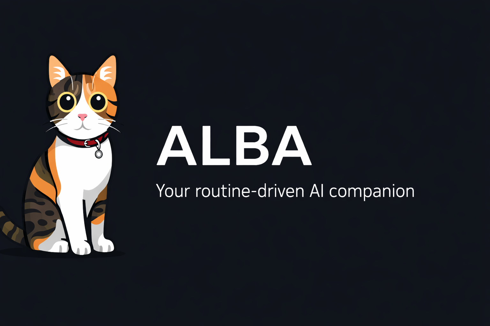
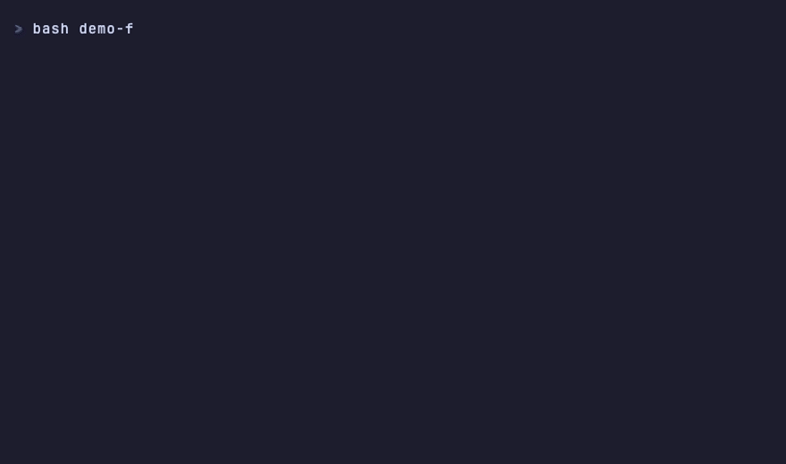

<p align="center">
  
</p>

<p align="center">
  <a href="README.md">English</a> | <b>Türkçe</b> | <a href="README.de.md">Deutsch</a>
</p>

<p align="center">
  <a href="LICENSE"></a>
  <a href="https://docs.claude.com/en/docs/claude-code"></a>
  <a href="https://github.com/anthropics/claude-code/releases"></a>
  <a href="https://github.com/onurpolat05/ALBA/stargazers"></a>
</p>

---

ALBA, Claude Code'u önceliklerinizi hatırlayan, hatalarınızdan öğrenen ve iş akışınıza uyum sağlayan bir **kişisel yapay zeka ajanına** dönüştürür — ister geliştirici, ister PM, araştırmacı, kurucu veya içerik üretici olun.

**10 dakikalık interaktif kurulum. Paket yöneticisi yok, build adımı yok, sürekli çalışan bir şey yok — bash script'leri ve markdown dosyaları.**

<p align="center">
  
</p>

## Sorun

Her yeni Claude Code oturumu sıfırdan başlar. Dünkü önceliklerinizden haberi yoktur. Projeleriniz hakkında bir bağlam taşımaz. Aynı hatalar tekrarlanır. İş akışınızı her seferinde yeniden anlatırsınız.

## Çözüm

```
you@machine:~/alba$ claude
> /setup
```

7 soruya cevap verin. ALBA; kalıcı hafıza, otomatik iş akışları ve kendini geliştiren davranışlarla — rolünüze özel bir ajan sistemi kurar.

## Ne Elde Ediyorsunuz

```
your-agent/
├── CLAUDE.md                     # Ajan beyni (< 200 satır)
├── memory/
│   ├── state/                    # Öncelikler, görevler (her oturumda güncellenir)
│   ├── knowledge/                # Öğrenimler, hatalar, tercihler (otomatik güncellenir)
│   ├── projects/                 # Proje bazlı bağlamlar
│   └── daily/                    # Oturum günlükleri (otomatik oluşturulur)
├── .claude/
│   ├── skills/                   # 9 yerleşik skill
│   ├── hooks/                    # 8 otomatik olay işleyici
│   ├── agents/                   # Subagent tanımları
│   ├── rules/                    # Davranış kuralları (otomatik yüklenir)
│   ├── docs/                     # Referans dokümanları (lazy-load)
│   └── settings.json             # Hook yapılandırması + izinler
```

## Temel Özellikler

### Kalıcı Hafıza

Oturumlar arasında kaybolmayan üç katmanlı, dosya tabanlı hafıza. Git ile takip edilir, insan tarafından okunabilir, sıfır bağımlılık.

```
/start              → önceki oturumun önceliklerini yükler
  ... çalışma ...
/end                → ilerlemeyi kaydeder, öğrenimleri not eder
  ... ertesi gün ...
/start              → tam kaldığınız yerden devam eder
```

### 9 Yerleşik Skill

| Skill | Amaç |
|-------|------|
| `/start` | Oturumu başlat — bağlamı yükle, öncelikleri göster |
| `/end` | Oturumu bitir — durumu kaydet, günlük oluştur |
| `/status` | Hızlı bakış — görevler, engeller, son oturum |
| `/research` | Yapılandırılmış çıktıyla web araştırması (subagent olarak çalışır) |
| `/weekly-review` | Haftalık performans değerlendirmesi ve gelecek hafta planlaması |
| `/extend` | İstediğiniz zaman yeni skill, hook veya kural ekleyin |
| `/reflect` | Oturumlar arası örüntü analizi |
| `/create-skill` | Rehberli skill oluşturma sihirbazı |
| `/setup` | İnteraktif ilk kurulum |

### 8 Otomatik Hook

| Claude Code olayı | Script | Ne olur |
|---|---|---|
| `SessionStart` | `session-start.sh` | Dashboard yüklenir, öncelikler gösterilir |
| `UserPromptSubmit` | `agent-suggest.sh` | Az önce yazdığınız şey için ilgili skill önerilir |
| `PreToolUse` | `bash-validator.sh` | Yıkıcı komut çalışmadan reddedilir |
| `PostToolUse` | `error-logger.sh` | Bash hataları örüntü tespiti için loglanır |
| `PostToolUseFailure` | `error-logger.sh` | Edit/Write/MCP hataları da loglanır |
| `Stop` | `memory-check.sh` | Durumu kaydetme hatırlatması — hız sınırlı, her turda değil |
| `SessionEnd` | `session-end.sh` | `/end` yazmayı atlasanız bile bugünün günlüğüne olgusal bir iz düşer |
| `PreCompact` / `PostCompact` | `pre-compact.sh`, `post-compact.sh` | Öncelikler context sıkıştırmasından sağ çıkar |

Dokuz kayıt, sekiz script — `error-logger.sh` iki tool-hatası olayına birden bağlıdır.

**Validator hakkında:** gerçekten yıkıcı olan kısa bir komut listesini reddeder, geri kalan her şeyde sessiz kalır. Sessiz derken *gerçekten* sessiz — çıktı yok, exit 0, normal izin akışı. `"allow"` yanıtı dönen bir `PreToolUse` hook'u izin promptunuzu tamamen atlar; dolayısıyla blocklist'inin kaçırdığı her şeyi onaylayan bir validator güvenlik ağı değil, bir deliktir. ALBA bu deliği v2.0.0'a kadar taşıdı.

### Kendini Geliştirme

ALBA çalışmanızdan öğrenir:
- **Hatalar** çözümleriyle birlikte otomatik kaydedilir (aynı hata bir daha tekrarlanmaz)
- **Öğrenimler** yeniden kullanılabilir kalıplar olarak saklanır
- **Tercihler** ajanı düzelttiğinizde güncellenir
- **`/reflect`** oturumlar arasındaki örüntüleri analiz eder ve yeni kurallar önerir

### Progressive Disclosure

CLAUDE.md 200 satırın altında kalır. Sistem dokümanları yalnızca ihtiyaç duyulduğunda lazy-load edilir — context pencerenizi verimli tutar.

---

## Hızlı Başlangıç

### Seçenek 1: GitHub Template (Önerilen)

GitHub'da **"Use this template"** butonuna tıklayın, ardından:

```bash
git clone https://github.com/YOUR-USERNAME/YOUR-REPO.git my-agent
cd my-agent
claude
```

### Seçenek 2: Doğrudan Clone

```bash
git clone https://github.com/onurpolat05/ALBA.git my-agent
cd my-agent
rm -rf .git && git init
claude
```

### Sonra:

```
/setup
```

7 soruya cevap verin (~10 dakika). Kişiselleştirilmiş ajanınız hazır.

**Klasörü ilk açtığınızda güven (trust) diyaloğunu kabul edin.** Kabul etmediğiniz sürece Claude Code, `settings.json` içindeki `permissions.allow` listesini yok sayar — hook'lar yine çalışır, ama sessizce geçmesi gereken okuma ve komutlar için izin sorulur; bu, güvenilmemiş bir klasörden çok bozuk bir kurulum gibi görünür.

---

## Günlük İş Akışı

```
Sabah:
  /start                    # "Öncelikleriniz: 1. API deadline Cuma  2. PR #42 review"

Çalışma sırasında:
  "research multi-agent patterns"    # /research subagent olarak çalışır
  "durumum ne?"                      # /status hızlı bakış gösterir

Gün sonu:
  /end                      # İlerlemeyi kaydeder, öğrenimleri not eder, günlük oluşturur

Cuma:
  /weekly-review            # Haftayı analiz eder, gelecek haftayı planlar

Her zaman:
  /extend                   # "İçerik oluşturma skill'i istiyorum" → oluşturur
  /loop 30m /status         # Periyodik hatırlatmalar, oturum kapsamlı
```

---

## Karşılaştırma

| Özellik | Ham Claude Code | Diğer Starter'lar | ALBA |
|---------|----------------|-------------------|------|
| Oturumlar arası hafıza | Yok | Kısmi (sadece hafıza) | 3 katmanlı (state/knowledge/projects) |
| Kurulum deneyimi | Manuel yapılandırma | Kopyala-yapıştır | İnteraktif sihirbaz (7 soru) |
| Rol desteği | Genel | Sadece geliştirici | Her rol (5 örnek dahil) |
| Kendini geliştirme | Hayır | Hayır | Otomatik hata + öğrenim yakalama |
| Hook'lar | Manuel kurulum | Bazı şablonlar | 8 hook, otomatik yapılandırılmış |
| Skill'ler | Yerleşik yok | Değişken | 9 yerleşik, genişletilebilir |
| Context verimliliği | N/A | N/A | Progressive disclosure (< 200 satır) |
| Config sağlık kontrolü | `/doctor` (kurulumunuz) | Hayır | `tools/doctor.sh` (config'in kendisi) |

---

## Örnekler

Eksiksiz ve çalışan kurulumlar için `examples/` klasörüne bakın:

| Rol | Odak |
|-----|------|
| **[Geliştirici](examples/developer/)** | Kod projeleri, git iş akışları, araştırma |
| **[Proje Yöneticisi](examples/project-manager/)** | Sprint yönetimi, paydaş güncellemeleri, takım koordinasyonu |
| **[İçerik Üretici](examples/content-creator/)** | İçerik takvimi, araştırma, çoklu platform yayınlama |
| **[Araştırmacı](examples/researcher/)** | Literatür taraması, kaynak yönetimi, atıf takibi |
| **[Kurucu](examples/founder/)** | Çoklu müşteri yönetimi, gelir takibi, kişisel marka |

Her örnek; önceden doldurulmuş dashboard'lar, örnek günlükler ve çalışan hook yapılandırmaları içerir.

---

## Mimari

### Skills

Skill'ler, YAML frontmatter taşıyan markdown dosyalarıdır. `description` alanı süs değildir — Claude bir skill'i çağırıp çağırmayacağına karar verirken okuduğu tek şey odur, bu yüzden ALBA'nın description'ları hem ne zaman tetikleneceğini hem ne zaman tetiklenmeyeceğini yazar:

```yaml
---
name: research
description: Structured web research with cited sources. Use when user says
  "research X", "look into X". Do NOT use for single-fact lookups.
context: fork              # subagent olarak çalışır, ana context temiz kalır
agent: general-purpose     # fork'un kullanacağı subagent tipi
background: false          # sonucu bu turda bekle (aşağıya bakın)
effort: medium
argument-hint: <topic> [deep]
allowed-tools: [Read, Write, Glob, Grep, WebSearch, WebFetch]
---
```

`context: fork` = ağır işler subagent olarak çalışır. `context: inline` = hızlı işler ana konuşmada çalışır.

**`background` tuzağı.** Claude Code v2.1.218'den beri `context: fork`, varsayılan olarak `background: true` kabul ediyor — subagent kopuk çalışıyor ve sonucu, kendisini çağıran turda geri dönmüyor. O sürümden önce yazılmış her fork skill'i, tek satırı bile değişmeden davranış değiştirdi. ALBA'nın `/research` ve `/reflect` skill'leri `background: false` alanını açıkça taşıyor, çünkü siz bir soru sordunuz ve cevabını şimdi bekliyorsunuz. ALBA'nın minimum sürümünün v2.1.218 olmasının nedeni de budur.

Tam frontmatter referansı: [`templates/skills/SKILL-TEMPLATE.md`](templates/skills/SKILL-TEMPLATE.md).

### Hafıza Sistemi

```
HOT  (her oturum)     →  memory/state/dashboard.md, todo.md
WARM (öğrenildiğinde) →  memory/knowledge/learnings.md, errors.md, preferences.md
COLD (proje bazlı)    →  memory/projects/[name]/context.md
LOGS (otomatik)       →  memory/daily/YYYY-MM-DD.md
```

### Hook Sistemi

Hook'lar, Claude Code olayları tarafından tetiklenen ve `.claude/settings.json` içinde bağlanan bash script'leridir. Otomatik çalışırlar — manuel çağırma gerekmez. Claude Code 30 hook olayı sunuyor; ALBA bunlardan dokuzunu kullanıyor ve hepsini [`templates/hooks/README-hooks.md`](templates/hooks/README-hooks.md) içinde belgeliyor.

Hook'lar sessizce ölür. Yanlış yazılmış bir olay adı, eksik bir iç `hooks` dizisi, alt dizinden açılan bir oturumda kırılan göreli yol — bunların hiçbiri hata üretmez. Özellik yalnızca hiç gerçekleşmez. `tools/doctor.sh` tam olarak bunun için var.

### Subagent'lar

`.claude/agents/` subagent tanımlarını tutar — Claude'un iş devredebileceği adlandırılmış roller. ALBA tek bir tane getiriyor, `planner.md`, ve onu bilinçli olarak ince tutuyor. Bir agent'ın tool'larını kısıtladığını iddia eden frontmatter alanlarının gerçekten zorlayıcı olduğu gösterilemedi; bu yüzden kısıt, config kılığına sokulmak yerine talimat olarak yazıldı. Sert bir sınır gerekiyorsa `permissions.deny` kullanın: deny kuralları, bir agent veya hook ne isterse istesin değerlendirilir.

### Tek Kaynak

Düzenlediğiniz tek yer `templates/`. Her örnek rolün içindeki `.claude/` ağacı buradan üretilir:

```bash
tools/sync-examples.sh          # examples/ klasörünü templates/ üzerinden yeniden üret
tools/sync-examples.sh --check  # hiçbir şeyi değiştirmeden drift raporla
tools/doctor.sh                 # tam sağlık kontrolü, commit öncesi çalıştır
```

Role özel dosyalar — `CLAUDE.md`, `README.md`, `memory/` — asla üzerine yazılmaz; bir örneğin asıl varlık nedeni zaten onlardır. v2.0.0 öncesinde her hook script'i aynı anda altı yerde duruyordu ve örnek dokümanları, şablonlarının tam bir sürüm gerisine düşmüştü.

### Uyumluluk

- **Claude Code auto-memory**: çakışma olmadan birlikte çalışır ([detaylar](.claude/docs/memory-compatibility.md))
- **`/loop` zamanlama**: oturum kapsamlı periyodik görevler ([detaylar](.claude/docs/loop-integration.md))
- **MCP sunucuları**: opsiyonel (Trello, Gmail, Calendar, Exa, Firecrawl) — ALBA bağımsız çalışır

---

## ALBA'yı Genişletme

Kurulumdan sonra istediğiniz zaman özellik ekleyin:

```
/extend
```

Ya da doğal bir şekilde isteyin:
- "E-posta taslağı için bir skill istiyorum"
- "Oturum sonunda otomatik commit yapan bir hook ekle"
- "Kod inceleme standartları için bir kural oluştur"
- "Trello board'umu bağla"

---

## Gereksinimler

- **Claude Code v2.1.218 veya üstü.** v2.1.220 ile doğrulandı. [Kurulum](https://docs.claude.com/en/docs/claude-code). Bu taban keyfi değil: fork edilen skill'lerdeki `background` alanı v2.1.218'de geldi ve o alan olmadan `/research` ile `/reflect` cevaplarını size değil bir arka plan görevine döndürür.
- **Git**
- **jq** — hook'lar olay JSON'unu ayrıştırmak için kullanır. jq olmadan her hook grep tabanlı bir yedeğe düşer, ama jq kurmak tek komutluk iş.

MCP sunucuları opsiyonel iyileştirmelerdir — ALBA tamamen bağımsız çalışır.

Claude Code'u güncelliyor musunuz? `tools/doctor.sh` çalıştırın. Sürümler arasında sessizce bozulan şeyleri kontrol eder: hook olay adları, settings şeması, ölü script yolları.

---

## Windows Kurulumu

ALBA'nın hook'ları bash script'leridir. Claude Code Windows'ta native çalışır (WSL gerekmez) ve bash komutlarını otomatik olarak Git Bash üzerinden yönlendirir — fakat birkaç ön koşul gerekli:

```powershell
# 1. Git for Windows kur (Git Bash sağlar)
winget install --id Git.Git -e

# 2. jq kur (hook'lar JSON ayrıştırmak için kullanır)
winget install --id jqlang.jq -e

# 3. Claude Code kur
irm https://claude.ai/install.ps1 | iex
```

Sonrasında ALBA'yı klonlayın ve repo kökünden `claude` komutunu çalıştırın — gerisini Git Bash halleder.

**Neden çalışır:** ALBA'nın `.gitattributes` dosyası `*.sh` dosyalarını LF satır sonuna zorlar; Windows'un varsayılan CRLF ayarının yol açtığı ve bash script'lerini bozan `bad interpreter: bash\r` hatası böylece önlenir.

**Alternatif:** WSL2 de çalışır (aynı kurulum adımları Linux dağıtımının içinde). Tam bir Linux toolchain'i tercih ediyorsanız WSL2 kullanın.

**Sorun giderme:** hook'lar `command not found: jq` ile başarısız olursa yukarıdaki komutla jq kurun. `bad interpreter` hatası görüyorsanız clone'unuz `.gitattributes`'tan öncedir — repo'yu yeniden klonlayın.

---

## Katkı

Katkılarınızı bekliyoruz! [CONTRIBUTING.md](CONTRIBUTING.md) dosyasına göz atın.

**En değerli katkılar:**
- Yeni roller için örnek kurulumlar
- Özel skill şablonları
- Hook tarifleri
- Entegrasyon kılavuzları

`templates/` klasörünü düzenleyin, asla `examples/` klasörünü değil — sonra PR açmadan önce `tools/sync-examples.sh` ve `tools/doctor.sh` çalıştırın.

---

## Lisans

MIT Lisansı — [LICENSE](LICENSE) dosyasına bakın

---

## Topluluk

- [GitHub Issues](https://github.com/onurpolat05/alba/issues) — Hata raporları ve özellik istekleri
- [GitHub Discussions](https://github.com/onurpolat05/alba/discussions) — Sorular ve fikirler

---

*ALBA — Tutarlı. Bağımsız. Sürekli öğrenen.*

> Adını Abla kedisinden alır. *Alba*, Latincede "şafak" anlamına gelir — yapay zeka iş akışınız için yeni bir başlangıç.

## Star History

<a href="https://star-history.com/#onurpolat05/ALBA&Date">
 <picture>
   <source media="(prefers-color-scheme: dark)" srcset="https://api.star-history.com/svg?repos=onurpolat05/ALBA&type=Date&theme=dark" />
   <source media="(prefers-color-scheme: light)" srcset="https://api.star-history.com/svg?repos=onurpolat05/ALBA&type=Date" />
   
 </picture>
</a>
